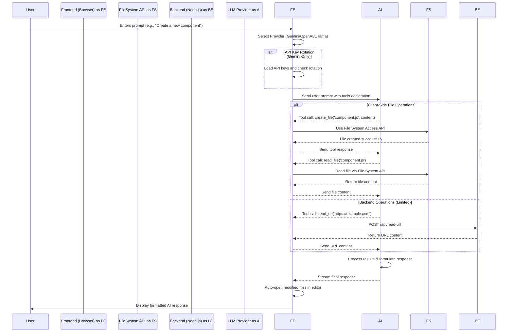
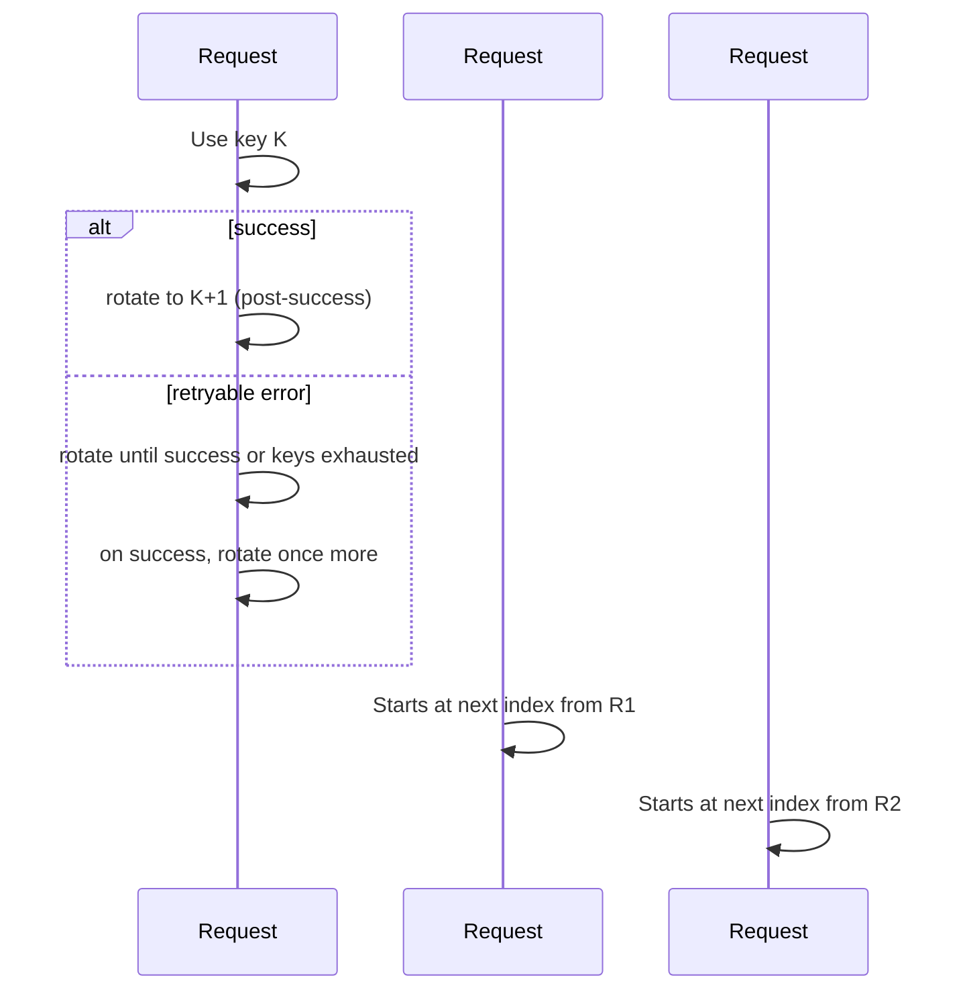

# AI-Powered Browser-Based Code Editor with Senior Engineer AI

This project is a sophisticated, browser-based code editor that integrates **Senior Engineer-level AI capabilities** to assist with advanced coding tasks, systematic debugging, and intelligent problem-solving. The application supports multiple LLM providers including **Google Gemini**, **OpenAI GPT**, and **Ollama**, designed with a secure, client-centric architecture where all file system operations run directly in the browser, providing a seamless and safe user experience.

## 🧠 Senior Engineer AI Capabilities

The editor now includes advanced AI systems that provide senior engineer-level analysis and decision-making:

- **🔍 Advanced Code Analysis**: Deep symbol resolution, data flow tracing, and architectural pattern recognition
- **🐛 Systematic Debugging**: Hypothesis-driven debugging with root cause analysis and evidence-based testing
- **📊 Code Quality Intelligence**: Comprehensive quality metrics, code smell detection, and maintainability analysis
- **🏗️ Architecture Optimization**: Design pattern recognition, anti-pattern detection, and optimization recommendations
- **🎯 Engineering Problem Solving**: Holistic problem analysis with multiple solution approaches and trade-off evaluation
- **🤖 Intelligent Auto-Context**: Automatically provides relevant file context when you ask questions about your current code


See [Senior Engineer AI Documentation](docs/SENIOR_ENGINEER_AI.md), [Auto-Context Feature Guide](docs/AUTO_CONTEXT_FEATURE.md), and [Task Management System](docs/TASK_MANAGEMENT.md) for detailed information.
---

## Core Architecture

The editor's architecture has been streamlined to use a local Node.js server, simplifying setup and management.

*   **Local Node.js Server**: A lightweight `Express` server (`backend/index.js`) serves the `frontend` assets, making the application accessible at `http://localhost:3333`. This approach provides a stable and consistent runtime environment.

*   **Client-Centric File Operations**: All core logic and file system interactions remain securely on the client-side in `frontend/js/main.js`. The application uses the browser's native **File System Access API**, ensuring that all file operations are handled directly and safely by the user's browser.

*   **Stateful Experience with IndexedDB**: The application uses IndexedDB to persist user data and session state locally, ensuring a seamless experience across page loads.

---

## Features

*   **Monaco Editor**: Integrates the same powerful editor used in VS Code, providing a rich and familiar coding environment with syntax highlighting and advanced editing features.
*   **Multi-Provider AI Support**: Flexible AI backend supporting multiple providers:
    *   **Google Gemini**: Latest models including Gemini 2.5 Pro, 2.5 Flash, and 2.5 Flash Lite with automatic API key rotation
    *   **OpenAI GPT**: Support for GPT-4.1, GPT-4o, o1-preview, o1-mini, and legacy models
    *   **Ollama**: Local model support for privacy-focused development
*   **Advanced Tool-Calling System**: All AI providers use a standardized tool-calling interface enabling:
    1.  **Tool Declaration**: The frontend declares 20+ available functions to the AI
    2.  **Function Call**: The AI responds with structured function calls when tools are needed
    3.  **Frontend Execution**: The browser executes requested functions (file operations, code analysis, etc.)
    4.  **Function Response**: Results are sent back to the AI in a standardized format
    5.  **Final Answer**: The AI provides natural-language responses based on tool results
*   **Resizable Panels**: A flexible UI with resizable panels for the file tree, editor, and AI chat.
*   **Intelligent Tab and File Management**:
    *   **Path-Based Identification**: Open files are tracked by their unique file path, which prevents the creation of duplicate tabs when a file is accessed multiple times.
    *   **Automatic Focus**: When the AI uses a tool like `read_file` or `rewrite_file`, the application automatically opens the relevant file or switches to its existing tab, providing a seamless workflow.
    *   **Stateful UI**: The file tree and open tabs are rendered dynamically, providing a clear and consistent view of the project state.
*   **Automatic File Opening**: When the AI agent reads, creates, or rewrites a file, it is automatically opened or focused, providing immediate visibility into the agent's actions.
*   **Task Management System**:
    *   **Task Tracking**: Create, update, and manage tasks with status tracking
    *   **Task Sessions**: Start focused work sessions for specific tasks
    *   **Session History**: Track time spent on each task with session records

*   **Comprehensive Tool Suite**: The AI has access to 40+ specialized tools organized by category:
    
    **🧠 Senior Engineer AI Tools:**
    *   `build_symbol_table` - Build comprehensive symbol tables for advanced code analysis
    *   `trace_data_flow` - Advanced data flow analysis and variable tracking
    *   `debug_systematically` - Hypothesis-driven systematic debugging
    *   `analyze_code_quality` - Comprehensive code quality analysis with metrics
    *   `solve_engineering_problem` - Holistic engineering problem solving
    *   `get_engineering_insights` - Engineering statistics and insights
    *   `optimize_code_architecture` - Architecture analysis and optimization
    
    **File Operations:**
    *   `create_file` - Create new files with content
    *   `read_file` - Read complete files or specific line ranges
    *   `edit_file` - Primary tool for all file modifications (replaces rewrite_file)
    *   `apply_diff` - Apply precise, surgical changes using diff blocks
    *   `find_and_replace` - Simple and reliable text replacement
    *   `insert_at_line` - Insert content at specific line numbers
    *   `replace_lines` - Replace line ranges with new content
    *   `smart_replace` - Fuzzy matching replacement for similar content
    *   `append_to_file` - Fast append content to end of file
    *   `rename_file` - Rename files and update references
    *   `delete_file` - Remove files from project
    
    **Directory Operations:**
    *   `create_folder` - Create new directories
    *   `rename_folder` - Rename directories  
    *   `delete_folder` - Remove directories
    *   `get_project_structure` - Display project file tree
    
    **Search & Analysis:**
    *   `search_code` - Search across all project files
    *   `search_in_file` - Search within specific files
    *   `query_codebase` - Semantic code search using AI indexing
    *   `build_or_update_codebase_index` - Maintain searchable code index
    *   `perform_research` - Enhanced recursive web research with AI-driven decision making
    *   `duckduckgo_search` - Perform web searches
    *   `read_url` - Read and extract content from URLs
    *   `analyze_code` - Analyze JavaScript file structure
    *   `format_code` - Format files with Prettier
    
    **Editor Integration:**
    *   `get_open_file_content` - Access currently open file
    *   `get_selected_text` - Get user-selected text
    *   `replace_selected_text` - Replace selected text
    *   `get_file_history` - View file modification history
    
    **Task Management:**
    *   `task_create` - Create new tasks with priorities and descriptions
    *   `task_update` - Update existing tasks with new status or information
    *   `task_delete` - Delete tasks and their subtasks
    *   `task_breakdown` - Break down high-level tasks into actionable subtasks
    *   `task_get_next` - Get the next logical task to work on
    *   `task_get_status` - Get task status and statistics
    *   `start_task_session` - Begin focused work sessions for specific tasks
*   **🤖 Intelligent Auto-Context Injection**: The AI automatically detects when your questions relate to the currently opened file and provides relevant context without manual intervention:
    *   **Smart Query Analysis**: Uses natural language processing to determine when file context would be helpful
    *   **Context Types**: Provides cursor context, selection context, error context, or smart file overview based on your query
    *   **Confidence Scoring**: Only injects context when confident it's relevant (60%+ confidence threshold)
    *   **Seamless UX**: Ask "How can I optimize this function?" and the AI immediately knows which function you mean
    *   **Visual Indicators**: Shows when auto-context is included with file name and confidence level
*   **Multimodal Input**: The AI chat supports both text and image uploads, allowing you to ask questions about visual content.
*   **Multiple Agent Modes**: Switch between different AI modes (`Code`, `Plan`, `Search`) to tailor the agent's behavior to your specific needs.
*   **Persistent Model Selection**: The application remembers your chosen AI model across sessions, saving you from having to re-select it on every visit.
*   **Customizable AI Behavior**:
    *   **Per-Mode Custom Rules**: Define unique sets of rules for each AI mode (`Code`, `Plan`). These rules are stored locally in your browser's IndexedDB.
    *   **Dynamic System Prompt**: Your custom rules are automatically injected into the AI's system prompt, allowing you to precisely tailor its behavior, enforce coding standards, or provide specific instructions for its workflow.
    *   **Immediate Application**: Rule changes are applied instantly to the next AI interaction.
    *   **Visible In-Chat Rules**: The currently active custom rules are displayed directly within the chat interface, providing constant visibility into the AI's operational context.
*   **Project-Wide Checkpoint System**:
    *   **Automatic Session Restore**: Your entire workspace—including all open files, their content, and the full chat history—is automatically saved to your browser's IndexedDB. This state is seamlessly restored when you reload the page.
    *   **Manual & Automatic Snapshots**: Create manual, named checkpoints of your entire workspace at any time. The system also automatically creates a timestamped checkpoint before the AI performs any file modification, ensuring you can always revert to a safe state.
    *   **Full Workspace Restoration**: Restore the entire project to a previous state from the Checkpoints manager. This action reverts all files to their snapshotted content and re-opens the exact set of files that were active at that time.
*   **Key Bug Fixes & Stability Improvements**:
    *   **API Stability**: Resolved a critical bug that caused an API error when the AI responded after a tool call, ensuring a stable and reliable chat experience.
    *   **File Path Correction**: Fixed an issue where the `get_project_structure` tool generated incorrect, nested file paths, improving the reliability of file operations.
    *   **Session Handling**: Addressed a bug where a restored project folder from a previous session was not correctly recognized by the AI's tools.
    *   **Diffing Stability**: Fixed a critical `Maximum call stack size exceeded` error in the diffing tool by implementing a line-based diffing algorithm. This ensures that modifications to large or complex files are handled efficiently and without crashing.

---

## Application Workflow

The following diagram illustrates the core workflow, showing how the browser-based frontend interacts with the local file system, the backend server, and AI providers (Gemini/OpenAI/Ollama) to execute tasks. Note the automatic API key rotation feature for Gemini providers.



---

## Getting Started

Running the application is now managed by simple, powerful scripts for all major operating systems.

### Prerequisites

*   [Node.js](https://nodejs.org/) (which includes `npm`) installed on your system.

### Installation and Management

The application includes interactive scripts to handle all aspects of installation, execution, and process management.

1.  **Launch the Management Script**:
    *   **On Windows**: Double-click `app.bat`.
    *   **On macOS / Linux**: First, make the script executable by running `chmod +x ./app.sh`, then run it with `./app.sh`.

2.  **Install Dependencies (First-Time Setup)**:
    *   From the script's main menu, select **[1] Install Dependencies**. This will download the necessary `npm` packages and install `pm2` globally.

3.  **Start the Server**:
    *   From the menu, select **[2] Start Server**. This will launch the application using `pm2`.

4.  **Access the Application**:
    *   Open your web browser (e.g., Chrome, Edge) and navigate to **`http://localhost:3333`**.

The management scripts also provide options to **stop**, **restart**, and **monitor** the server, as well as **enable/disable auto-startup** on system reboot.

### Configuration

1.  **Configure AI Provider**:
    *   In the AI Chat panel, click the "Settings" gear icon to open LLM Settings
    *   Choose your preferred provider tab (Gemini, OpenAI, or Ollama)
    *   **For Gemini**: Enter one or more API keys (separate by new lines for automatic rotation)
    *   **For OpenAI**: Enter your OpenAI API key and select your preferred model  
    *   **For Ollama**: Configure your local Ollama instance URL and model name
    *   Click "Save Settings" - all keys are stored securely in your browser's IndexedDB

2.  **Select AI Model**:
    *   **Gemini**: Choose from Gemini 2.5 Pro, 2.5 Flash, 2.5 Flash Lite, or legacy 1.5 models
    *   **OpenAI**: Select from GPT-4.1, GPT-4o, o1-preview, o1-mini, or other available models
    *   **Ollama**: Configure your locally-hosted model (e.g., Llama 3, Code Llama)

3.  **Open a Project**:
    *   Click the "Open Project Folder" button
    *   Select a local directory to work with - the application will remember this folder for future sessions

---
 
## Gemini API Key Rotation Policy

This project implements a round-robin Gemini API key rotation system with both success-advance and error-retry semantics.

- Input multiple Gemini API keys separated by new lines in LLM Settings.
- The system preserves your current key index across requests.
- After each successful request, the index advances to the next key automatically.
- On retryable errors (rate limits, auth issues, network/timeout, 503/overload, stream/parse errors), the system rotates to the next key and retries until:
  - success (then it still advances), or
  - all keys have been tried in this request (throws the last error)

Implementation references:
- Rotation logic lives in [`GeminiService.sendMessageStream()`](frontend/js/llm/gemini_service.js:18)
- Success-advance occurs here: [`GeminiService.sendMessageStream()`](frontend/js/llm/gemini_service.js:85)
- Retryable error detection: [`GeminiService._isRetryableError()`](frontend/js/llm/gemini_service.js:118)
- Index persistence across requests: [`ApiKeyManager.loadKeys()`](frontend/js/api_manager.js:10)
- Rotation primitive: [`ApiKeyManager.rotateKey()`](frontend/js/api_manager.js:64)

Mermaid overview (per-request behavior):
```mermaid
flowchart TD
  A[Start request] --> B[ApiKeyManager.loadKeys\n(preserve index)]
  B --> C[resetTriedKeys]
  C --> D{Try current key}
  D -->|success| E[rotateKey once\nfor next request]
  E --> F[return]
  D -->|retryable error| G[rotateKey and retry]
  G --> D
  D -->|non-retryable or all keys tried| H[throw error]
```

Mermaid overview (cross-request round-robin):


Notes:
- With a single key, rotation is a no-op by design and behavior remains correct.
- Duplicate keys are allowed but reduce the usefulness of “all keys tried” checks; prefer unique keys per line.

## For Developers

Interested in contributing? We welcome your help!

Our **[Contributing Guide](./docs/CONTRIBUTING.md)** contains all the information you need to get started, including:

*   A detailed architectural overview.
*   The complete development setup and workflow.
*   Our coding standards and best practices.

We recommend reading the guide to understand the project's design and how to contribute effectively.

### 📚 Complete Documentation

For comprehensive documentation including tool references, architecture details, and feature guides, see our **[Documentation Overview](./docs/DOCS_OVERVIEW.md)** which provides organized access to all project documentation.

