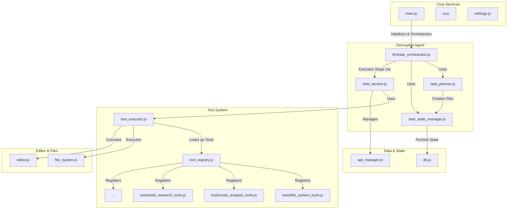
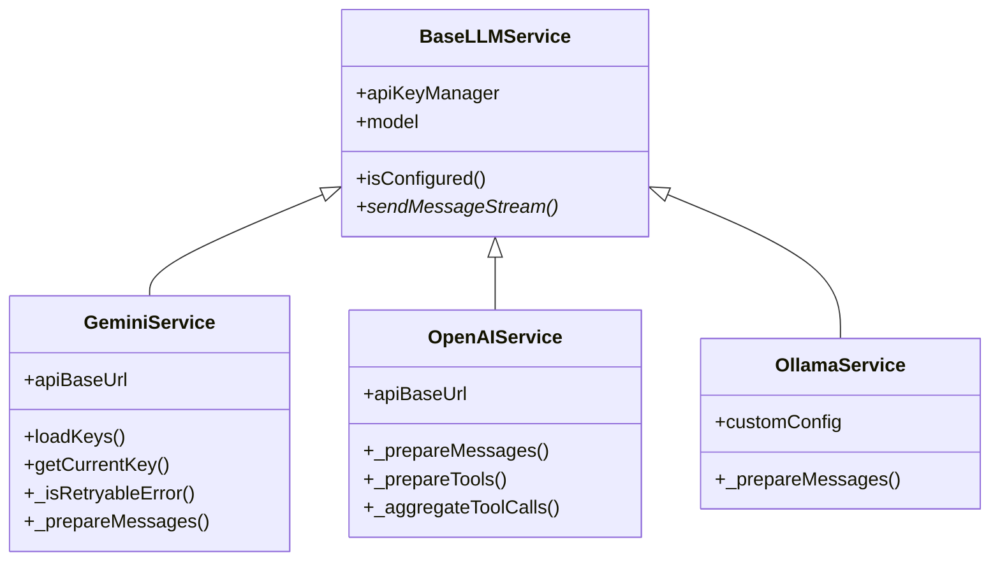
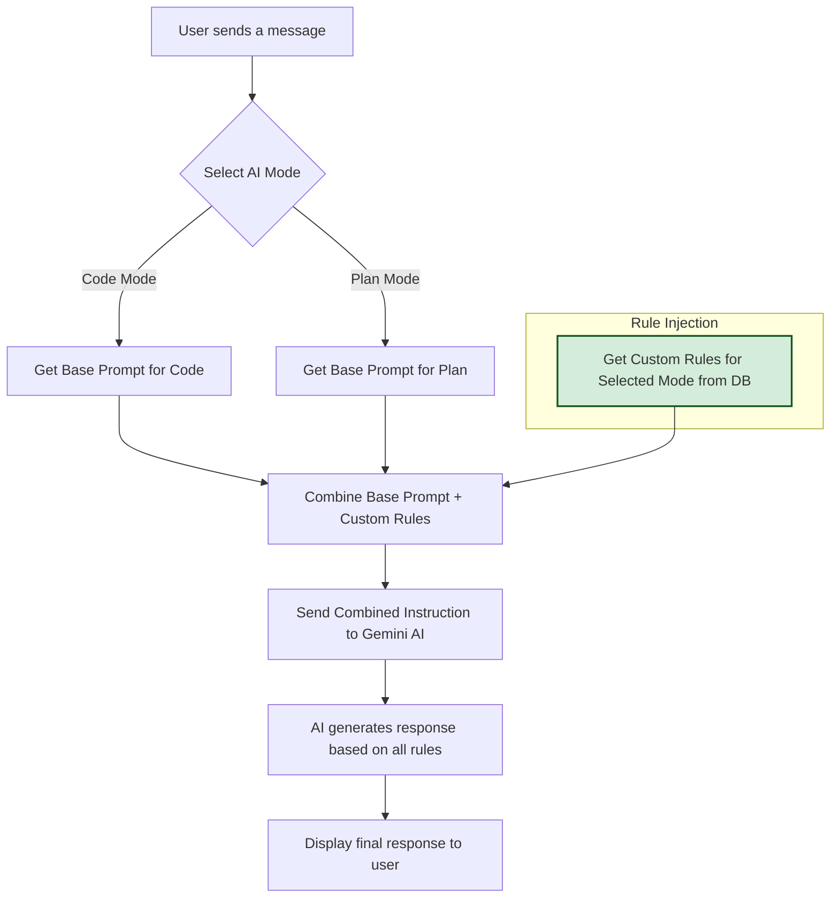
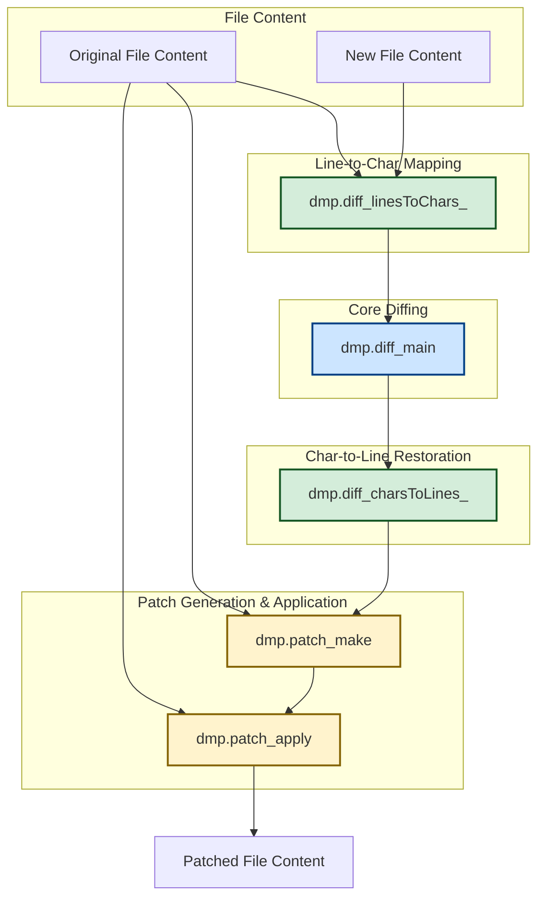

# Application Architecture

This document provides a high-level overview of the application's architecture. For a more detailed guide on the project structure, development workflow, and how to contribute, please see the **[Contributing Guide](./CONTRIBUTING.md)**.

## Core Philosophy: Client-Centric and Decoupled

The application is architected to be **secure, extensible, and frontend-heavy**. The majority of the logic, including all file system interactions, the editor, and the AI agent, runs directly in the browser. A minimal backend is used only for tasks that the browser's sandbox cannot perform.

The recent architectural refactoring has focused on decoupling core components to improve maintainability, testability, and extensibility, moving from a monolithic agent to a system of coordinated, single-responsibility services.

## Component Overview

*   **Frontend**: A single-page application built with vanilla JavaScript, HTML, and CSS. It uses the Monaco Editor and manages all core application logic.
*   **Backend**: A lightweight Node.js/Express server that serves static files and provides URL fetching capabilities.
*   **AI Agents**: A multi-provider AI system managed on the client-side, now composed of several decoupled services:
    *   **`TaskOrchestrator`**: The central coordinator that manages the overall lifecycle of a user-initiated task.
    *   **`TaskPlanner`**: A dedicated service responsible for breaking down high-level goals into concrete, executable steps using an LLM.
    *   **`TaskStateManager`**: Manages the state of the active task, including its plan, execution history, and context.
    *   **`ToolRegistry`**: A dynamic registry that allows tools to be defined in separate modules and registered at runtime, decoupling them from the executor.
    *   **`ToolExecutor`**: The component responsible for executing tool calls requested by the AI. It now looks up tools in the `ToolRegistry`.
    *   **Provider Services**: Gemini, OpenAI, and Ollama service implementations, managed by a `ServiceFactory`.

## Decoupled Agent Architecture

The diagram below illustrates the new, decoupled architecture. The `TaskOrchestrator` acts as the entry point, coordinating between the `TaskPlanner` to create a plan, the `TaskStateManager` to track progress, and the `ChatService` (which uses the `ToolExecutor`) to execute steps.



This decoupled design provides several advantages:
- **Separation of Concerns**: Each component has a single, well-defined responsibility.
- **Extensibility**: Adding new tools is as simple as creating a new module and registering it in `main.js`. No changes are needed to the core execution logic.
- **Testability**: Each component can be tested in isolation.
- **Maintainability**: The codebase is easier to understand and modify.

## Dynamic Tool Registration

The new `ToolRegistry` (`frontend/js/tool_registry.js`) provides a centralized mechanism for managing tools. Instead of being hardcoded in the `ToolExecutor`, tools are now defined in their own modules within the `frontend/js/tools/` directory.

Each tool module contains the tool's handler function and a registration function that adds it to the `ToolRegistry`.

**Example: `file_system_tools.js`**
```javascript
// frontend/js/tools/file_system_tools.js

import { ToolRegistry } from '../tool_registry.js';
import * as FileSystem from '../file_system.js';

// Handler function for the tool
async function _getProjectStructure(params, rootHandle) {
    const ignorePatterns = await FileSystem.getIgnorePatterns(rootHandle);
    const tree = await FileSystem.buildStructureTree(rootHandle, ignorePatterns);
    const structure = FileSystem.formatTreeToString(tree);
    return { structure };
}

// Registration function
export function registerFileSystemTools() {
  ToolRegistry.register('get_project_structure', {
    handler: _getProjectStructure,
    requiresProject: true,
    description: "Gets the project file structure."
  });
  // ... register other file system tools
}
```

These modules are then imported and registered during application startup in `main.js`.

**Example: `main.js`**
```javascript
// frontend/js/main.js

import { registerFileSystemTools } from './tools/file_system_tools.js';
import { registerCodeAnalysisTools } from './tools/code_analysis_tools.js';
// ... other tool imports

document.addEventListener('DOMContentLoaded', async () => {
    // ... initialization
    registerFileSystemTools();
    registerCodeAnalysisTools();
    // ... register other tool modules
});
```

This pattern makes the system highly extensible and keeps the core `ToolExecutor` clean and focused on its single responsibility: executing tools.

## Multi-Provider LLM Architecture

The application supports multiple AI providers through a unified interface:

### Provider Hierarchy


### API Key Rotation (Gemini Only)

Gemini service implements a round-robin API key rotation policy with:
- Rotation on retryable errors within the same request
- Automatic advance to the next key after a successful request
- Index persistence across requests (the next request starts from the next key)

Implementation references:
- Rotation loop and success-advance: [`GeminiService.sendMessageStream()`](../frontend/js/llm/gemini_service.js:18)
- Retryable error detection: [`GeminiService._isRetryableError()`](../frontend/js/llm/gemini_service.js:118)
- Index persistence across requests: [`ApiKeyManager.loadKeys()`](../frontend/js/api_manager.js:10)
- Rotation primitive: [`ApiKeyManager.rotateKey()`](../frontend/js/api_manager.js:64)

```mermaid
flowchart TD
    A[Start Request] --> B[ApiKeyManager.loadKeys<br/>(preserve index)]
    B --> C[resetTriedKeys]
    C --> D{Try Current Key}
    D -->|Success| E[rotateKey once<br/>for NEXT request]
    E --> F[Return Response]
    D -->|Retryable Error<br/>(429/401/403/503/network/stream)| G{Untried Keys Left?}
    G -->|Yes| H[rotateKey and Retry]
    H --> D
    G -->|No| I[Throw Final Error]
```

Notes:
- Success path rotates once so the next request continues round-robin.
- With a single key, rotation is a no-op by design.
- Duplicate keys reduce the usefulness of “all keys tried”; prefer unique keys per line.

## State Management

The application's state is persisted entirely within the browser's **IndexedDB**, ensuring a robust and seamless user experience. The database (`CodeEditorDB`) is managed by `frontend/js/db.js` and contains several object stores:

*   **`apiKeys`**: Stores the user's Gemini API keys.
*   **`fileHandles`**: Persists the handle to the root project directory, allowing for quick reconnection.
*   **`sessionState`**: Automatically saves the entire workspace state (open files, active tab, unsaved content, and chat history) before the page unloads. This state is restored when the application starts, preventing any loss of work.
*   **`checkpoints`**: Stores complete, project-wide snapshots. Before the AI executes a destructive operation (like `rewrite_file`, `create_file`, or `apply_diff`), it saves the entire state of the editor (all open files, their content, and view states) as a single checkpoint. This allows for a full, commit-style restore of the workspace to a previous point in time.
*   **`codeIndex`**: Caches a searchable index of the codebase for performance.
*   **`settings`**: Stores miscellaneous user preferences, such as the last selected AI model.
*   **`customRules`**: Stores user-defined rules for each AI mode, allowing for persistent, fine-grained control over the AI's behavior.

This comprehensive state management ensures that both the user's configuration and their work-in-progress are preserved across sessions.

## System Stability and Error Handling

The architecture includes several mechanisms to ensure stability and provide a reliable user experience:

*   **API-Compliant Payloads**: The communication with the Gemini API is carefully structured to adhere to its strict requirements. For instance, `functionResponse` parts are sent in dedicated messages, separate from any other content, preventing API errors and ensuring the tool-calling loop remains stable.
*   **Robust Session Restoration**: The session and file handle management has been hardened to correctly restore the project context, even after a page reload, ensuring that AI tools have immediate and correct access to the file system.
*   **Accurate File Path Generation**: The logic for generating the project's file structure has been corrected to prevent erroneous paths, ensuring that all file-based tool calls (`create_file`, `delete_file`, etc.) operate reliably.

## Custom Rule Injection Workflow

To ensure the AI's behavior can be tailored by the user, custom rules are dynamically injected into the system prompt before every request. This process guarantees that the AI always operates with the most up-to-date instructions for the selected mode.




---

## High-Performance Diffing Architecture

The `apply_diff` tool provides an efficient and stable way to modify files. To avoid performance bottlenecks and stack overflow errors when processing large files, the application uses a **line-based diffing strategy** implemented in `frontend/js/tool_executor.js`.

This approach, powered by the `diff-match-patch` library, avoids a direct, character-by-character comparison of the entire file content. Instead, it converts each line into a single character, performs the diff on this much smaller dataset, and then translates the results back into line-based changes.

The workflow is as follows:



This architecture ensures that the diffing process is both fast and memory-efficient, making the AI agent's file modification capabilities robust and scalable.

---
## LLM Observability, Health Metrics, and Debug Panel

To improve reliability and debuggability across providers, we added first-class observability and a lightweight circuit breaker.

### Provider Health Metrics (BaseLLMService)
- Location: frontend/js/llm/base_llm_service.js
- Method: getHealthStatus()
- Reported fields:
  - provider, model
  - isHealthy
  - requestCount, successfulRequests, failedRequests
  - successRate (rolling percentage)
  - averageResponseTime (ms)
  - lastError (message only, no sensitive data)
  - configuration (sanitized config details)

These metrics are updated automatically by the centralized send/stream entrypoint (sendMessageStream()), so all providers report consistent telemetry without duplicating logic.

### Centralized Retry, Backoff, and Key Rotation
- Location: frontend/js/llm/base_llm_service.js, frontend/js/llm/retry_policy.js, frontend/js/llm/key_rotation.js, frontend/js/llm/error_policy.js
- Features:
  - Standard error classification and retryability decisions
  - Exponential backoff with jitter
  - Request-scoped API key rotation on retryable failures
  - Rotate-on-success to maintain fair round-robin distribution across keys
  - Abort-aware early exits

Enable verbose diagnostics via Settings:
- Key: llm.common.debugLLM (default: false)
- When enabled, BaseLLMService logs key retry/rotation attempts, backoff delays, and request lifecycle events.

### Simple Circuit Breaker
- Location: frontend/js/llm/base_llm_service.js (within sendMessageStream())
- Behavior:
  - Trips to “open” after repeated failures (configurable thresholds)
  - Enters cooldown before accepting new requests
  - Uses a “half-open” probe to test recovery and auto-close on success

This protects the UI from spamming a failing provider/key set and provides clear signals in the debug panel.

### In-App Debug Panel
- Markup: frontend/index.html (Chat header → bug icon + slide-in panel)
- Logic: frontend/js/main.js (wires UI controls), frontend/js/chat_service.js (data source)
- Data Provider: ChatService.getLLMDebugInfo() exposes:
  - Provider and model
  - Current API key index (masked current key preview), and “tried all keys” state
  - isHealthy and full getHealthStatus() snapshot

What you’ll see in the panel:
- Real-time health metrics for the active provider
- Key rotation index and state (never shows full secret)
- Buttons to refresh the snapshot and (optionally) reset metrics

Notes:
- The panel is read-only with respect to secrets; keys are never printed. A short masked preview (e.g., sk-12..9Z) is used to indicate which key is active.
- Toggle debug logs globally via Settings.get('llm.common.debugLLM').
- The panel auto-refresh interval and controls wiring live in main.js.
