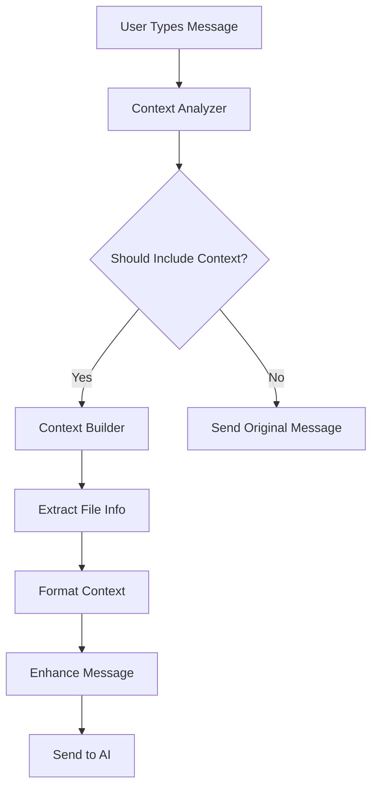

# 🤖 Intelligent Auto-Context Injection

The AI Code Editor now features intelligent auto-context injection that automatically provides relevant file information to the AI when it detects that your question relates to the currently opened file.

## 🎯 How It Works

### **Smart Query Analysis**
The system analyzes your questions using natural language processing to determine if context from the current file would be helpful:

```javascript
// Examples of queries that trigger auto-context:
"How can I optimize this function?"          // ✅ Context injected
"What's wrong with this code?"               // ✅ Context injected  
"Fix the error on line 23"                  // ✅ Context injected
"Explain this logic"                         // ✅ Context injected

// Examples that don't trigger auto-context:
"How to create a React component?"          // ❌ General question
"What's the difference between let and var?" // ❌ Educational query
"Create a new file called utils.js"         // ❌ File creation request
```

### **Context Intelligence Levels**

#### **🔍 Pattern Recognition**
- **Code Reference Keywords**: Detects words like "this", "here", "current", "fix", "debug", "optimize"
- **Question Patterns**: Recognizes patterns like "What does this do?", "How can I improve this?"
- **Error-Related Queries**: Identifies debugging and troubleshooting requests

#### **📊 Confidence Scoring**
- **High Confidence (85%+)**: Clear code-related questions with context keywords
- **Medium Confidence (60-84%)**: Ambiguous but likely code-related queries  
- **Low Confidence (<60%)**: General questions that don't need file context

### **Context Types**

#### **🎯 Smart Context (Default)**
- File overview with structure
- Code around cursor position (±20 lines)
- File metadata (language, total lines)

#### **🐛 Error Context**
- Current errors and warnings
- Code around error locations
- Syntax highlighting for problem areas

#### **⚡ Selection Context**
- Currently selected text
- Surrounding context (±5 lines)
- Selection metadata

#### **📍 Line Context**
- Specific line ranges mentioned in query
- Function/method containing the line
- Related code blocks

## 🚀 User Experience

### **Before Auto-Context**
```
User: "How can I optimize this function?"
AI: "I'd be happy to help optimize a function. Could you please share the code?"
User: [Has to manually copy/paste or use read_file tool]
```

### **After Auto-Context**
```
User: "How can I optimize this function?"
🤖 Auto-context: utils.js (25 lines, confidence: 89%)

AI: "Looking at the `calculateTotal` function in your utils.js file, I can see several optimization opportunities:

1. You can use Array.reduce() instead of a for loop
2. Consider using arrow functions for better performance
3. Add input validation for edge cases

Here's the optimized version..."
```

## 🔧 Technical Implementation

### **Architecture Overview**



### **Key Components**

#### **1. Context Analyzer** (`context_analyzer.js`)
- Analyzes user queries for context relevance
- Pattern matching and keyword detection
- Confidence scoring algorithm
- Context type determination

#### **2. Context Builder** (`context_builder.js`)
- Extracts file information from Monaco Editor
- Formats context for AI consumption
- Handles different context types (cursor, selection, errors)
- File structure analysis

#### **3. Chat Service Integration** (`chat_service.js`)
- Seamless integration with existing chat flow
- Auto-context injection in message preparation
- Visual indicators for context inclusion
- Graceful fallback on errors

### **Context Format Example**

```markdown
## Current File Context: utils.js
**Language:** javascript | **Total Lines:** 45
**Cursor Position:** Line 23, Column 15

**📋 File Structure:**
- Line 1: function calculateTotal
- Line 15: function formatCurrency  
- Line 28: function validateInput

**📄 Code Context (cursor):**
```javascript
 20 | function calculateTotal(items) {
 21 |     let total = 0;
 22 |     for (let i = 0; i < items.length; i++) {
 23 >         total += items[i].price * items[i].quantity;
 24 |     }
 25 |     return total;
 26 | }
```

---

**User Question:** How can I optimize this function?
```

## 📈 Benefits

### **🎯 Seamless UX**
- **Zero Manual Work**: No need to mention files or use tools
- **Instant Context**: AI immediately understands what you're working on
- **Smart Decisions**: Only includes context when relevant

### **⚡ Improved Efficiency**
- **Faster Responses**: AI has immediate context
- **Better Accuracy**: More targeted and relevant suggestions
- **Reduced Back-and-forth**: Fewer clarification questions

### **🧠 Intelligent Behavior**
- **Context-Aware**: Understands cursor position and selections
- **Error-Aware**: Automatically includes error information when debugging
- **File-Aware**: Provides file structure and metadata

## 🛠️ Configuration

### **Smart Defaults**
The system works out-of-the-box with intelligent defaults:
- **Auto-detection**: Enabled by default
- **Context Limits**: 50 lines maximum per context
- **Confidence Threshold**: 60% minimum for context injection

### **Customization Options**
Future versions may include:
- Context inclusion preferences
- File size limits for auto-context
- Custom keyword patterns
- Context preview before sending

## 🔍 Examples in Action

### **Debugging Scenario**
```
File: app.js (Error on line 15)
User: "Why is this throwing an error?"

Auto-Context Injected:
- Error details from Monaco Editor
- Code around line 15
- Function containing the error
- File structure for context

AI Response: "The error on line 15 is caused by trying to access 'undefined.property'. The issue is that 'user' might be null when..."
```

### **Code Review Scenario**
```
File: components/Header.jsx (Selection: lines 25-35)
User: "Is this component optimized?"

Auto-Context Injected:
- Selected React component code
- Surrounding context
- File metadata (JSX, 120 lines)

AI Response: "Looking at your Header component, I can see a few optimization opportunities:
1. Memoize the component with React.memo()
2. Extract inline styles to constants..."
```

### **Refactoring Scenario**
```
File: utils/database.js (Cursor at line 42)
User: "How can I improve this?"

Auto-Context Injected:
- Function around cursor
- File structure showing related functions
- Database utility context

AI Response: "The `connectToDatabase` function can be improved by:
1. Adding connection pooling
2. Implementing retry logic
3. Better error handling..."
```

## 🎉 Impact

The intelligent auto-context feature transforms the AI Code Editor from a general-purpose assistant into a **context-aware coding companion** that understands exactly what you're working on and provides targeted, relevant assistance without any manual setup.

This creates a seamless development experience where the AI feels like it's "looking over your shoulder" and ready to help with whatever code you're currently focused on.