# 📚 Documentation Overview

This document provides a comprehensive overview of all documentation available for the AI-Powered Browser-Based Code Editor.

## 📁 Documentation Structure

```mermaid
graph TD
    subgraph "📖 Core Documentation"
        README[README.md<br/>Main project overview]
        CLAUDE[CLAUDE.md<br/>Claude Code instructions]
        ARCH[ARCHITECTURE.md<br/>System architecture]
        CONTRIB[CONTRIBUTING.md<br/>Developer guide]
    end

    subgraph "🔧 Technical References"
        TOOLS[TOOL_DOCUMENTATION.md<br/>Complete tool reference]
        PROPOSALS[TOOL_PROPOSALS.md<br/>Future tool ideas]
        SENIOR[SENIOR_ENGINEER_AI.md<br/>Advanced AI features]
        TASK[TASK_MANAGEMENT.md<br/>Task system docs]
    end

    subgraph "✨ Feature Documentation"
        AUTO[AUTO_CONTEXT_FEATURE.md<br/>Auto-context system]
        ENHANCE[ENHANCEMENTS.md<br/>Recent improvements]
        UI[UI_IMPROVEMENTS.md<br/>UI enhancements]
        RESEARCH[RESEARCH_IMPLEMENTATION.md<br/>Research features]
    end

    subgraph "📋 Project Management"
        ROADMAP[ROADMAP.md<br/>Development roadmap]
        STANDARDS[CODING-STANDARDS.md<br/>Code standards]
        GUIDE[AI_TASK_MANAGEMENT_GUIDE.md<br/>Task management guide]
        GIT[GIT_ALTERNATIVES.md<br/>Git alternatives]
    end

    subgraph "📐 Architecture Decision Records"
        ADR[adr/<br/>Architecture decisions]
        ADR001[001-refactoring-strategy.md]
        ADR002[002-dependency-injection-system.md]
        ADR003[003-error-handling-strategy.md]
        ADR004[004-performance-monitoring.md]
    end

    README --> ARCH
    README --> CONTRIB
    CLAUDE --> TOOLS
    ARCH --> SENIOR
    TOOLS --> PROPOSALS
    CONTRIB --> STANDARDS
    AUTO --> SENIOR
    ENHANCE --> UI
    TASK --> GUIDE
    ADR --> ADR001
    ADR --> ADR002
    ADR --> ADR003
    ADR --> ADR004
```



## 🎯 Quick Start Guide

### For New Users
1. **Start here**: [README.md](../README.md) - Project overview and setup
2. **Installation**: Follow the installation guide in README.md
3. **Basic usage**: Learn about AI capabilities and tool system

### For Developers
1. **Architecture**: [ARCHITECTURE.md](./ARCHITECTURE.md) - System design overview
2. **Contributing**: [CONTRIBUTING.md](./CONTRIBUTING.md) - Development workflow
3. **Standards**: [CODING-STANDARDS.md](./CODING-STANDARDS.md) - Code quality guidelines

### For Claude Code Users
1. **Instructions**: [CLAUDE.md](../CLAUDE.md) - Specific guidance for Claude Code
2. **Tools**: [TOOL_DOCUMENTATION.md](./TOOL_DOCUMENTATION.md) - Complete tool reference
3. **Advanced Features**: [SENIOR_ENGINEER_AI.md](./SENIOR_ENGINEER_AI.md) - AI capabilities

## 📚 Documentation Categories

### 🏗️ Architecture & Design

| Document | Purpose | Audience |
|----------|---------|----------|
| [ARCHITECTURE.md](./ARCHITECTURE.md) | System architecture overview | Developers, Architects |
| [adr/](./adr/) | Architecture decision records | Technical team |
| [CONTRIBUTING.md](./CONTRIBUTING.md) | Development guidelines | Contributors |

### 🛠️ Tools & Features

| Document | Purpose | Audience |
|----------|---------|----------|
| [TOOL_DOCUMENTATION.md](./TOOL_DOCUMENTATION.md) | Complete tool reference | Users, Developers |
| [TOOL_PROPOSALS.md](./TOOL_PROPOSALS.md) | Future tool ideas | Product team |
| [SENIOR_ENGINEER_AI.md](./SENIOR_ENGINEER_AI.md) | Advanced AI features | Power users |
| [AUTO_CONTEXT_FEATURE.md](./AUTO_CONTEXT_FEATURE.md) | Auto-context system | Users |

### 📋 Project Management

| Document | Purpose | Audience |
|----------|---------|----------|
| [ROADMAP.md](./ROADMAP.md) | Development roadmap | Stakeholders |
| [TASK_MANAGEMENT.md](./TASK_MANAGEMENT.md) | Task system docs | Users, Developers |
| [AI_TASK_MANAGEMENT_GUIDE.md](./AI_TASK_MANAGEMENT_GUIDE.md) | Task management guide | Users |

### ✨ Enhancements & Improvements

| Document | Purpose | Audience |
|----------|---------|----------|
| [ENHANCEMENTS.md](./ENHANCEMENTS.md) | Recent improvements | Users, Stakeholders |
| [UI_IMPROVEMENTS.md](./UI_IMPROVEMENTS.md) | UI enhancements | Users, Designers |
| [RESEARCH_IMPLEMENTATION.md](./RESEARCH_IMPLEMENTATION.md) | Research features | Users |

### 📖 Standards & Guidelines

| Document | Purpose | Audience |
|----------|---------|----------|
| [CODING-STANDARDS.md](./CODING-STANDARDS.md) | Code quality standards | Developers |
| [GIT_ALTERNATIVES.md](./GIT_ALTERNATIVES.md) | Git alternatives | Developers |

## 🔍 Finding Information

### By Role

#### **End Users**
- Getting started: [README.md](../README.md)
- Feature overview: [ENHANCEMENTS.md](./ENHANCEMENTS.md)
- Tool usage: [TOOL_DOCUMENTATION.md](./TOOL_DOCUMENTATION.md)
- Task management: [AI_TASK_MANAGEMENT_GUIDE.md](./AI_TASK_MANAGEMENT_GUIDE.md)

#### **Developers**
- Architecture: [ARCHITECTURE.md](./ARCHITECTURE.md)
- Contributing: [CONTRIBUTING.md](./CONTRIBUTING.md)
- Standards: [CODING-STANDARDS.md](./CODING-STANDARDS.md)
- ADRs: [adr/](./adr/)

#### **Product Managers**
- Roadmap: [ROADMAP.md](./ROADMAP.md)
- Features: [ENHANCEMENTS.md](./ENHANCEMENTS.md)
- Proposals: [TOOL_PROPOSALS.md](./TOOL_PROPOSALS.md)

#### **Claude Code Users**
- Instructions: [CLAUDE.md](../CLAUDE.md)
- Tools: [TOOL_DOCUMENTATION.md](./TOOL_DOCUMENTATION.md)
- Advanced AI: [SENIOR_ENGINEER_AI.md](./SENIOR_ENGINEER_AI.md)

### By Topic

#### **Setup & Installation**
- [README.md](../README.md) - Main setup guide
- [CONTRIBUTING.md](./CONTRIBUTING.md) - Development setup

#### **AI Features**
- [SENIOR_ENGINEER_AI.md](./SENIOR_ENGINEER_AI.md) - Advanced AI capabilities
- [AUTO_CONTEXT_FEATURE.md](./AUTO_CONTEXT_FEATURE.md) - Auto-context system
- [TOOL_DOCUMENTATION.md](./TOOL_DOCUMENTATION.md) - All available tools

#### **Architecture**
- [ARCHITECTURE.md](./ARCHITECTURE.md) - System overview
- [adr/](./adr/) - Architecture decisions
- [CODING-STANDARDS.md](./CODING-STANDARDS.md) - Code organization

#### **Task Management**
- [TASK_MANAGEMENT.md](./TASK_MANAGEMENT.md) - System documentation
- [AI_TASK_MANAGEMENT_GUIDE.md](./AI_TASK_MANAGEMENT_GUIDE.md) - Usage guide

#### **Recent Changes**
- [ENHANCEMENTS.md](./ENHANCEMENTS.md) - Feature improvements
- [UI_IMPROVEMENTS.md](./UI_IMPROVEMENTS.md) - Interface updates
- [RESEARCH_IMPLEMENTATION.md](./RESEARCH_IMPLEMENTATION.md) - Research features

## 🚀 Recommended Reading Paths

### 🆕 New to the Project
```
README.md → ARCHITECTURE.md → TOOL_DOCUMENTATION.md → ENHANCEMENTS.md
```

### 👨‍💻 Want to Contribute
```
README.md → CONTRIBUTING.md → CODING-STANDARDS.md → adr/
```

### 🤖 Using AI Features
```
SENIOR_ENGINEER_AI.md → AUTO_CONTEXT_FEATURE.md → TOOL_DOCUMENTATION.md
```

### 📋 Managing Tasks
```
AI_TASK_MANAGEMENT_GUIDE.md → TASK_MANAGEMENT.md → TOOL_DOCUMENTATION.md
```

## 📝 Documentation Standards

### Format Guidelines
- **Markdown**: All documentation uses GitHub Flavored Markdown
- **Mermaid**: Diagrams use Mermaid syntax for version control
- **Emojis**: Consistent emoji usage for visual organization
- **Headers**: Consistent heading hierarchy and numbering

### Content Standards
- **Accuracy**: Documentation reflects current implementation
- **Completeness**: All features and tools are documented
- **Examples**: Code examples and usage patterns included
- **Updates**: Documentation updated with code changes

### File Organization
- **Core docs**: Root level for main documentation
- **Technical docs**: `docs/` directory for detailed references
- **ADRs**: `docs/adr/` for architecture decisions
- **Legacy**: Outdated docs moved to appropriate subdirectories

## 🔄 Keeping Documentation Updated

### When to Update
- ✅ New features added
- ✅ Existing features modified
- ✅ Architecture changes
- ✅ Tool additions/removals
- ✅ Process changes

### Update Process
1. **Code changes**: Update relevant documentation
2. **Review**: Ensure accuracy and completeness
3. **Links**: Verify all internal links work
4. **Examples**: Update code examples if needed
5. **Version**: Note changes in commit messages

---

This documentation structure ensures comprehensive coverage of the AI Code Editor while maintaining organization and accessibility for all user types.