# Tool Documentation

This comprehensive guide provides details on all available tools, their behaviors, and best practices for their use.

---

## 🏗️ Tool Architecture Overview

```mermaid
graph TB
    subgraph "🧠 Senior Engineer AI Tools"
        BST[build_symbol_table]
        TDF[trace_data_flow]
        DS[debug_systematically]
        ACQ[analyze_code_quality]
        SEP[solve_engineering_problem]
        GEI[get_engineering_insights]
        OCA[optimize_code_architecture]
    end

    subgraph "📁 File Operations"
        CF[create_file]
        RF[read_file]
        EF[edit_file]
        AD[apply_diff]
        FAR[find_and_replace]
        IAL[insert_at_line]
        RL[replace_lines]
        SR[smart_replace]
        AF[append_to_file]
        DF[delete_file]
        RNF[rename_file]
    end

    subgraph "📂 Directory Operations"
        CFD[create_folder]
        DFD[delete_folder]
        RNF[rename_folder]
        GPS[get_project_structure]
    end

    subgraph "🔍 Search & Analysis"
        SC[search_code]
        SIF[search_in_file]
        PR[perform_research]
        DDS[duckduckgo_search]
        RU[read_url]
        AC[analyze_code]
        FC[format_code]
        BC[build_or_update_codebase_index]
        QC[query_codebase]
    end

    subgraph "✏️ Editor Integration"
        GOFC[get_open_file_content]
        GST[get_selected_text]
        RST[replace_selected_text]
        GFH[get_file_history]
    end

    subgraph "📋 Task Management"
        TC[task_create]
        TU[task_update]
        TD[task_delete]
        TB[task_breakdown]
        TGN[task_get_next]
        TGS[task_get_status]
        STS[start_task_session]
    end

    subgraph "🔧 Advanced Analysis"
        AS[analyze_symbol]
        ECS[explain_code_section]
        TVF[trace_variable_flow]
        VS[validate_syntax]
    end

    BST --> EF
    TDF --> AS
    DS --> VS
    ACQ --> AC
    EF --> VS
    AD --> RF
    FAR --> RF
    SR --> RF
    GPS --> CF
    SC --> SIF
    PR --> RU
    TC --> TB
    TB --> TU
    TU --> TGN
    AS --> TVF
    ECS --> AS
```

## 🚀 Tool Categories Overview

The AI Code Editor provides 40+ specialized tools organized into the following categories:

- **🧠 Senior Engineer AI Tools** - Advanced code analysis and engineering problem solving
- **📁 File Operations** - Create, read, edit, and manage files
- **📂 Directory Operations** - Manage folders and project structure
- **🔍 Search & Analysis** - Find and analyze code across the project
- **✏️ Editor Integration** - Work with the current editor state
- **📋 Task Management** - Organize and track development tasks

---

## 🧠 Senior Engineer AI Tools

These tools provide advanced code analysis and engineering-level problem solving:

### `build_symbol_table`
- **Purpose**: Build comprehensive symbol tables for advanced code analysis
- **Use Case**: Understanding complex codebases and symbol relationships

### `trace_data_flow` 
- **Purpose**: Advanced data flow analysis and variable tracking
- **Use Case**: Following how data moves through your application

### `debug_systematically`
- **Purpose**: Hypothesis-driven systematic debugging
- **Use Case**: Structured approach to finding and fixing bugs

### `analyze_code_quality`
- **Purpose**: Comprehensive code quality analysis with metrics
- **Use Case**: Assessing and improving code maintainability

### `solve_engineering_problem`
- **Purpose**: Holistic engineering problem solving
- **Use Case**: Complex technical decision making and architecture planning

### `get_engineering_insights`
- **Purpose**: Engineering statistics and insights
- **Use Case**: Understanding project metrics and patterns

### `optimize_code_architecture`
- **Purpose**: Architecture analysis and optimization recommendations
- **Use Case**: Improving system design and performance

---

## 📁 File Operations

### Primary Editing Tools

#### `edit_file` ⭐ **PRIMARY TOOL**
- **Purpose**: The main tool for all file modifications
- **Parameters**: 
  - `filename` (string): File path
  - `content` (string): Complete file content for small files
  - `edits` (array): Targeted edits for large files
- **Usage**: Provides EITHER complete content OR targeted edits array
- **Best Practice**: Use `read_file` first to get current content

#### `apply_diff` ⭐ **RECOMMENDED**
- **Purpose**: Apply precise, surgical changes using diff blocks
- **Format**: Requires specific diff block format with `<<<<<<< SEARCH`, `=======`, and `>>>>>>> REPLACE`
- **Best Practice**: Most reliable for targeted changes
- **Requires**: Exact line matching including whitespace

### Alternative Editing Tools

#### `find_and_replace`
- **Purpose**: Simple and reliable text replacement
- **Parameters**: `filename`, `find_text`, `replace_text`, `all_occurrences`
- **Best For**: When you know exact text to replace

#### `insert_at_line`
- **Purpose**: Insert content at specific line numbers
- **Parameters**: `filename`, `line_number`, `content`, `insert_mode`
- **Modes**: `before`, `after`, `replace`

#### `replace_lines`
- **Purpose**: Replace a range of lines with new content
- **Parameters**: `filename`, `start_line`, `end_line`, `new_content`
- **Best For**: Replacing entire sections or functions

#### `smart_replace`
- **Purpose**: Fuzzy matching replacement for similar content
- **Parameters**: `filename`, `old_content`, `new_content`, `similarity_threshold`
- **Best For**: When content might have changed slightly

### Basic File Operations

#### `create_file`
- **Purpose**: Create new files with content
- **Parameters**: `filename`, `content`
- **Note**: Do NOT include root directory name in path

#### `read_file`
- **Purpose**: Read file contents
- **Parameters**: `filename`, `include_line_numbers` (optional)
- **Best Practice**: Use `include_line_numbers: true` when editing

#### `read_multiple_files`
- **Purpose**: Read and concatenate multiple files
- **Parameters**: `filenames` (array)
- **Use Case**: Multi-file context analysis

#### `read_file_lines`
- **Purpose**: Read specific line ranges
- **Parameters**: `filename`, `start_line`, `end_line`
- **Use Case**: Quick inspection of code sections

#### `append_to_file`
- **Purpose**: Fast append to end of file
- **Parameters**: `filename`, `content`
- **Use Case**: Logs, incremental updates

#### `get_file_info`
- **Purpose**: Get file metadata without reading content
- **Parameters**: `filename`
- **Returns**: Size, last modified, type

#### `delete_file`
- **Purpose**: Remove files from project
- **Parameters**: `filename`

#### `rename_file`
- **Purpose**: Rename or move files
- **Parameters**: `old_path`, `new_path`

---

## 📂 Directory Operations

#### `create_folder`
- **Purpose**: Create new directories
- **Parameters**: `folder_path`

#### `delete_folder`
- **Purpose**: Delete folders and contents
- **Parameters**: `folder_path`

#### `rename_folder`
- **Purpose**: Rename or move directories
- **Parameters**: `old_folder_path`, `new_folder_path`

#### `get_project_structure`
- **Purpose**: Display complete project file tree
- **Use Case**: Understanding project organization
- **Best Practice**: Use before file operations

---

## 🔍 Search & Analysis

### Code Search Tools

#### `search_code`
- **Purpose**: Search for strings across all project files (like grep)
- **Parameters**: `search_term`
- **Use Case**: Finding all occurrences of text

#### `search_in_file`
- **Purpose**: Search within specific files
- **Parameters**: `filename`, `pattern`, `context` (optional)
- **Use Case**: Large file analysis

### Code Indexing (Legacy vs Current)

#### `build_or_update_codebase_index` (Legacy)
- **Purpose**: Build searchable codebase index
- **Note**: Manual trigger required, can be slow
- **Status**: Legacy system

#### `query_codebase` (Legacy)
- **Purpose**: Search the IndexedDB index
- **Note**: Must build index first

### Web Research Tools

#### `perform_research` ⭐ **ENHANCED**
- **Purpose**: Intelligent, recursive web research with AI-driven decisions
- **Parameters**: `query`, `max_results`, `depth`, `relevance_threshold`
- **Features**: Automatic link following, relevance scoring

#### `duckduckgo_search`
- **Purpose**: Basic web search
- **Parameters**: `query`

#### `read_url`
- **Purpose**: Read and extract content from URLs
- **Parameters**: `url`
- **Returns**: Content and links

### Code Analysis Tools

#### `analyze_code`
- **Purpose**: Analyze JavaScript file structure
- **Parameters**: `filename`
- **Use Case**: Understanding code organization

#### `format_code`
- **Purpose**: Format files with Prettier
- **Parameters**: `filename`
- **Requirements**: Valid code syntax
- **Note**: Client-side Web Worker execution

---

## ✏️ Editor Integration

#### `get_open_file_content`
- **Purpose**: Get currently open file content
- **Use Case**: Working with active file

#### `get_selected_text`
- **Purpose**: Get user-selected text in editor
- **Requirements**: User must select text first

#### `replace_selected_text`
- **Purpose**: Replace currently selected text
- **Parameters**: `new_text`
- **Requirements**: User must select text first

#### `get_file_history`
- **Purpose**: View file modification history
- **Note**: Git integration disabled in browser version
- **Parameters**: `filename`

---

## 📋 Task Management

### Core Task Operations

#### `task_create`
- **Purpose**: Create new tasks
- **Parameters**: `title`, `description`, `priority`, `parentId`, `listId`
- **Priorities**: `low`, `medium`, `high`, `urgent`

#### `task_update` ⚠️ **MANDATORY PARAMETERS**
- **Purpose**: Update existing tasks
- **Parameters**: `taskId` (REQUIRED), `updates` (REQUIRED object)
- **Example**: `{taskId: "123", updates: {status: "completed", notes: "Done"}}`

#### `task_delete`
- **Purpose**: Delete tasks and subtasks
- **Parameters**: `taskId`

#### `task_breakdown` 🎯 **CRITICAL**
- **Purpose**: Break high-level tasks into specific, actionable subtasks
- **Parameters**: `taskId`
- **Best Practice**: Create concrete tasks, not generic ones

### Task Information

#### `task_get_next`
- **Purpose**: Get next logical task based on priority/dependencies
- **Use Case**: Workflow automation

#### `task_get_status`
- **Purpose**: Get task status and statistics
- **Parameters**: `taskId` (optional)
- **Returns**: Specific task info or overview

#### `start_task_session`
- **Purpose**: Start focused work sessions
- **Parameters**: `taskId`, `description`, `duration`
- **Use Case**: Time tracking and focus

---

## 🔧 Advanced Code Analysis

#### `analyze_symbol`
- **Purpose**: Analyze symbols across entire codebase
- **Parameters**: `symbol_name`, `file_path`, `analysis_type`
- **Features**: Cross-file analysis, usage patterns

#### `explain_code_section`
- **Purpose**: Detailed explanations of code blocks
- **Parameters**: `file_path`, `start_line`, `end_line`
- **Use Case**: Understanding complex code

#### `trace_variable_flow`
- **Purpose**: Follow variable data flow through files
- **Parameters**: `variable_name`, `file_path`
- **Use Case**: Debugging and understanding data movement

#### `validate_syntax`
- **Purpose**: Comprehensive syntax checking
- **Parameters**: `file_path`, `language`
- **Best Practice**: Use before code modifications

---

## ⚠️ Deprecated Tools

#### `rewrite_file` (Deprecated)
- **Status**: Use `edit_file` instead
- **Reason**: Less safe, prone to data loss

#### `get_file_history` (Limited)
- **Status**: Git features disabled in browser version
- **Alternative**: Use local git client

---

## 🏆 Best Practices

### 1. Tool Selection Priority

1. **For file editing**: `apply_diff` > `edit_file` > `find_and_replace`
2. **For search**: `search_code` for exact matches, `perform_research` for web
3. **For analysis**: Use Senior Engineer AI tools for complex understanding

### 2. Safety Guidelines

- ✅ Always use `read_file` before editing
- ✅ Use `validate_syntax` before complex modifications  
- ✅ Use `get_project_structure` before file operations
- ✅ Prefer targeted edits over full file rewrites

### 3. Performance Tips

- Use `read_file_lines` for large files
- Use `get_file_info` to check size before reading
- Use `append_to_file` for incremental updates
- Use `smart_replace` when content might have changed

### 4. Task Management Workflow

1. Create tasks with `task_create`
2. Break down complex tasks with `task_breakdown`
3. Start focused sessions with `start_task_session`
4. Update progress with `task_update`
5. Get next task with `task_get_next`

---

## 🚫 Important Notes

- **Root Directory**: Never include root directory name in file paths
- **Line Numbers**: Use 1-based line numbering (not 0-based)
- **Content Format**: Never wrap file content in markdown backticks
- **Selection Tools**: Require manual user text selection first
- **Validation**: Some tools require valid syntax to function

---

This documentation reflects the current tool implementations. For the most up-to-date tool definitions, see `frontend/js/tool_executor.js`.